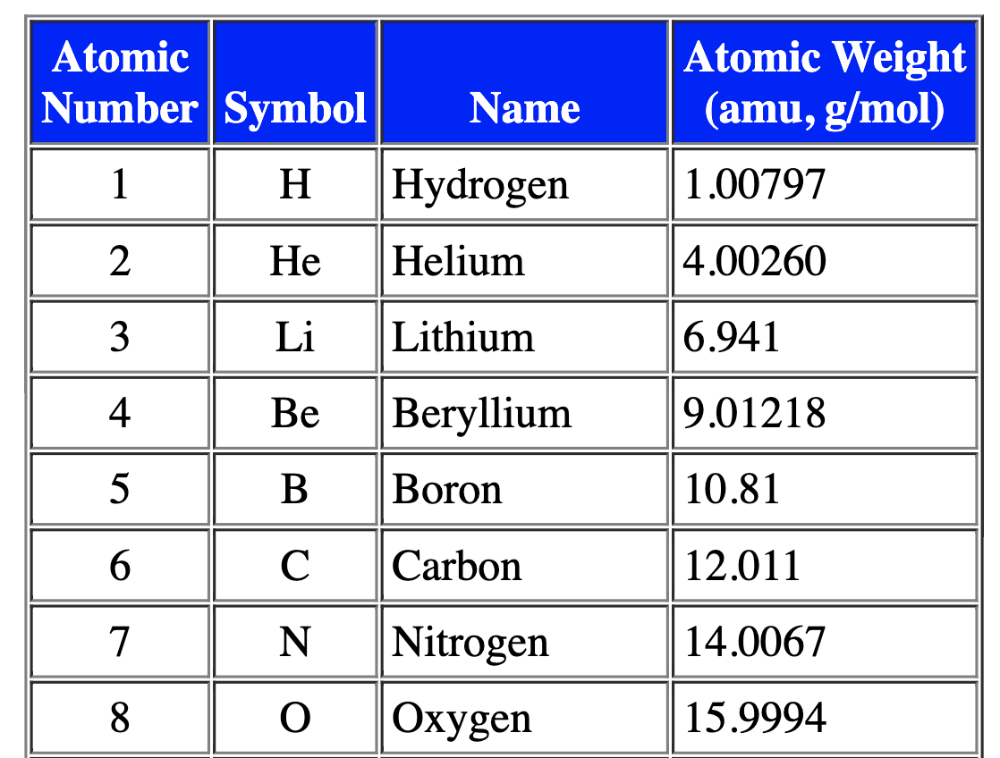
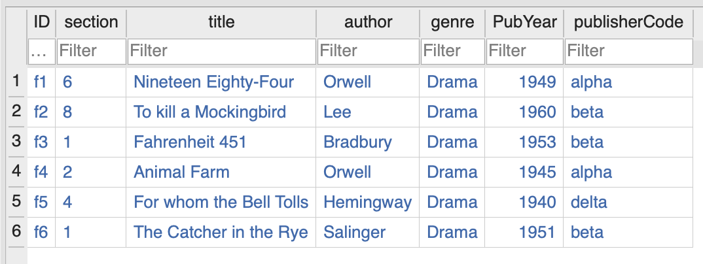
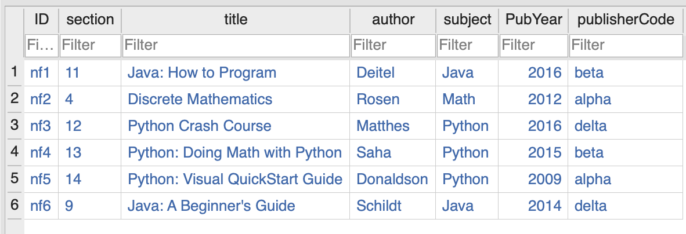
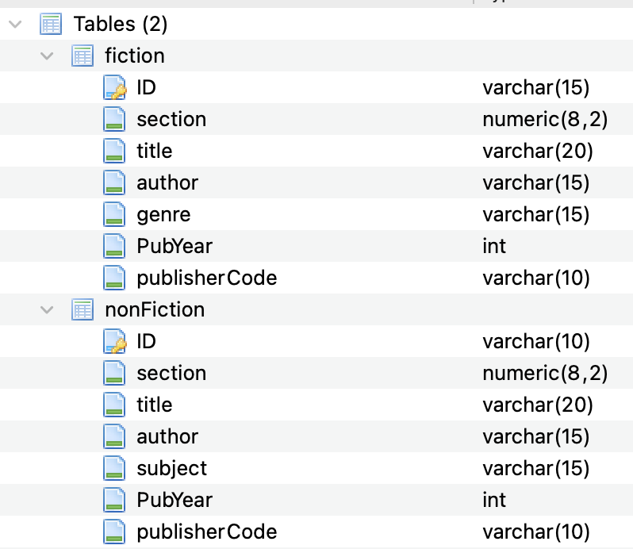

## cs312S2022

Please add your responses to this file.

### Exam 1

#### Name

Add Your Name Here

#### Due Date

5 April 2022 by 3pm

This is your exam 1. This is not a group project; please work individually. Online searches are not allowed, but you are allowed to use class notes, slides and code from class to complete this exam. You are allowed to use Sqlite3 or BDBrowser to work on this exam.  

You are to follow the exam file (`writing/exam1.md`) to complete the questions. In one of the problems, you will be asked to submit source material in the `src/` directory.  

Best of luck to you. Dr. BONHAM-CARTER

### Part 1

#### 1. [5 points]

What is an "inconsistent dependency" in table management? Give an example to help explain your point.

YOUR RESPONSE: `TODO`

---
#### 2. [15 points]

Imagine that you have two tables ("TableA" and "TableB") created from the code shown below. Prepare a JOIN query which will give you the exact output shown below. Note, on the third line, only the information from "TableA" can be shown and that the _num_ attributes from each table have been equated.

```

DROP TABLE TableA;
CREATE TABLE TableA (
num VARCHAR,
myChar VARCHAR
);


DROP TABLE TableB;
CREATE TABLE TableB (
num VARCHAR,
myChar VARCHAR
);

INSERT INTO TableA VALUES (1,"A");
INSERT INTO TableA VALUES (3,"A");
INSERT INTO TableA VALUES (4,"A");


INSERT INTO TableB VALUES (1,"B");
INSERT INTO TableB VALUES (2,"B");
INSERT INTO TableB VALUES (3,"B");
```

##### Tables, content and output:

**TableA**
```
1_A
3_A
4_A
```

**TableB**
```
1_A
2_B
3_B
```

**Output from query involving a join**
```
B|1|1|A
B|3|3|A
||4|A
```

---
#### 3. [15 points]

Write SQL code to create a table for the atomic data shown below using similar names for attributes. Also in your code, you are to use three specific _Integrity Constraints_ to ensure only similar data may be added to the each attribute.



YOUR RESPONSE: `TODO`

---
#### 4. [5 points]

In the below figure for this problem, there are two tables, "Fiction" and "Nonfiction". The data and details for each table have been shown in the Figures below.


FIGURE: Fiction data table.


FIGURE: Non-fiction data table.


FIGURE: Schema information for above tables.

Using the two tables and their attributes, determine which query from the answer key  would give the below query output.

Output:

```
Nineteen Eighty-Four
Animal Farm
```

ANSWER BANK

A. select title from fiction where publishercode != "alpha";

B. select fiction.title from fiction where fiction.publishercode == "alpha";

C. select title from non.fiction where non.publishercode == "alpha";

D. select title from fiction.nonfiction where fiction.nonfiction(publishercode) == "alpha";

YOUR RESPONSE: `TODO`

---
#### 5. [5 points]

In the below figure for this problem, there are two tables, "Fiction" and "Nonfiction". The data and details for each table have been shown in the Figures below.


FIGURE: Fiction data table.


FIGURE: Non-fiction data table.


FIGURE: Schema information for above tables.

Using the two tables and their attributes, determine the query that would give the below query output.

Output:

```
Nineteen Eighty-Four
```

ANSWER BANK

A. select title from fiction where author = "Orwell" and pubYear == "1949";

B. select title from fiction where author = "Orwell" and pubYear == "1945";

C. select bookTitle from fiction where author = "Orwell" and pubYear == "1949";

D. select title from fiction where author = "Orwell";

YOUR RESPONSE: `TODO`

---
#### 6. [5 points]

In the below figure for this problem, there are two tables, "Fiction" and "Nonfiction". The data and details for each table have been shown in the Figures below.


FIGURE: Fiction data table.


FIGURE: Non-fiction data table.


FIGURE: Schema information for above tables.

Using the two tables and their attributes, determine the query that would give the below query output.

Output:

```
Java: How to Program
Python: Doing Math with Python
```

ANSWER BANK

A. select nonFiction.publishcode from nonFiction where nonFiction.publishercode == nonFiction.beta;

B. select title from fiction, nonFiction where publishercode == "beta";

C. select title from nonFiction where nonFiction.publishercode == beta;

D. select nonFiction.title from nonFiction where nonFiction.publishercode == "beta";

YOUR RESPONSE: `TODO`

---
#### 7. [5 points]

In the below figure for this problem, there are two tables, "Fiction" and "Nonfiction". The data and details for each table have been shown in the Figures below.


FIGURE: Fiction data table.


FIGURE: Non-fiction data table.


FIGURE: Schema information for above tables.

Using the two tables and their attributes, determine the query that would give the below query output.

Output:

```
To kill a Mockingbird
Fahrenheit 451
```

ANSWER BANK

A. select title from fiction where ID == "f2" OR ID == "f3" AND ID != "h1";

B. select title from fiction where ID == "f2" AND ID == "f3";

C. select title from fiction where ID = ("nf4", "f5");

D. select title from fiction where title == "To kill a Mockingbird" AND title == "Fahrenheit 451";

YOUR RESPONSE: `TODO`

---
#### 8. [5 points]

In the below figure for this problem, there are two tables, "Fiction" and "Nonfiction". The data and details for each table have been shown in the Figures below.


FIGURE: Fiction data table.


FIGURE: Non-fiction data table.


FIGURE: Schema information for above tables.


Using the two tables, determine what the following query will return.

```
select nonfiction.title from nonfiction where nonfiction.author like "S%";
```

ANSWER BANK

A. Python: Doing Math with Python and Java: A Beginner's Guide

B. The Catcher in the Rye and Java: How to Program

C. Donaldson and Rosen

D. Discrete Mathematics and Python: Doing Math with Python

YOUR RESPONSE: `TODO`

---
#### 9. [20 points]

Create a working database to manage article references. Below are eight references for a literature review for "Data Science". In this problem, you are to prepare a database (called `articleBD.sqlite3`) to manage all information of the citations of the articles according to the below list of guiding rules (listed below) to create an article database. Note: as you create your tables, you are to consider the necessary types of attributes to build working code for a SQLite3 build_file (called, `builder_articleBD.txt`) for your article database submission.   

##### Rules

 + Prepare your data files in a CSV format to be used to populate your database. Use the below references for your data.
 + Create a table called "Author" to contain the names of all authors in the references of publications.
 + Create a table called "Journal" to contain the names of all organizations who serve to publish the work of each article in the list of references.
 + Create a Table called "Title" to contain each title along with the associated year and page numbers each reference.
 + Each table is to have to have a unique primary key of your choosing.
 + The "Journal" and "Title" tables will have a foreign keys.
   + The "Journal" table has a foreign key to link it with the "Author" table. This key permits a journal reference to be added _only after_ the article's author has been added to the "Author" table.
	 + The "Title" table has a foreign key to link it with the "Journal" table. This key permits a title reference to be added _only after_ the article's journal detail has been added to the "Journal" table.

 + You are to provide a working build file (that I can use to build and study your database) to create and populate your database (using your data files) with the below-listed citations.
 + Please place your database build file in the `src/` directory.
 + Please place your database text file in `src/data/` along with your completed database. Your datafiles have the following names.

  + `src/data/authorData.csv`
  + `src/data/titleData.csv`
  + `src/data/journalData.csv`


### References:

 + Dogan, Alican, and Derya Birant. "Machine learning and data mining in manufacturing." Expert Systems with Applications 166 (2021): 114060.

 + Regin, R., S. Suman Rajest, and Bhopendra Singh. "Spatial Data Mining Methods Databases and Statistics Point of Views." Innovations in Information and Communication Technology Series (2021): 103-109.

 + Thakkar, Harshil, "Comparative anatomization of data mining and fuzzy logic techniques used in diabetes prognosis." Clinical eHealth 4 (2021): 12-23.

 + Haoxiang, Wang, and S. Smys. "Big Data Analysis and Perturbation using Data Mining Algorithm." Journal of Soft Computing Paradigm (JSCP) 3.01 (2021): 19-28.

 + Schorn, Michelle A., "A community resource for paired genomic and metabolomic data mining." Nature Chemical Biology 17.4 (2021): 363-368.

 + Liu, Chi. "Microeco: an R package for data mining in microbial community ecology." FEMS microbiology ecology 97.2 (2021): fiaa255.

 + Ageed, Zainab Salih. "Comprehensive survey of big data mining approaches in cloud systems." Qubahan Academic Journal 1.2 (2021): 29-38.

 + Sanad, Zakeya, and Abdalmuttaleb Al-Sartawi. "Financial statements fraud and data mining: a review." European, Asian, Middle Eastern, North African Conference on Management & Information Systems. Springer, Cham, 2021.

 ```
 Please remove this TODO when the task has been completed.
 ```

---
#### 10. [20 points]

Query your database: Please provide the queries to the below queries.

 + What is the `schema` of the entire database?

 ```
 TODO
 ```

 + What is the content of each of the tables?

 ```
 TODO
 ```

 + Give a listing of the Titles followed by the names of the authors.

 ```
 TODO
 ```

 + Give a listing of the Titles, Publishers and the authors (in that order) of all references.

 ```
 TODO
 ```
 + Give a query to list the Author, Journal and page numbers of all references.

 ```
 TODO
 ```

---
Did you remember to add your name at the top of this document?
